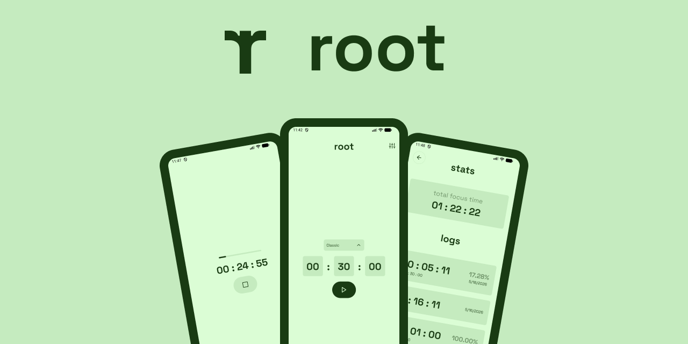

# Root
Root is a distraction-free, offline-first, minimalist focus timer. 

[](https://opensource.org/licenses/MIT)

--- 

## Table of Contents
- [Features](#-features)
- [Tech Stack](#-tech-stack)
- [Getting Started](#-getting-started)
- [License](#-license)

--- 

## Features
- **Recognizes distraction**: Programmed to detect when phone is picked up or app is backgrounded, and instantly terminates the timer.
- **Local-first architecture**: Root is designed to run completely offline. You data stays on your device at all times.
- **Zero distractions**: No gamification, simple minimal interface to maximize productivity.
- **Control data**: Root allows you to export, import or delete all logs in one tap. 

--- 

## Tech Stack
- App is made using **React Native**.
- **Expo** APIs used for additional functionality.
- **React Native Async Storage** for key-value based local storage of sessions. 

--- 

## Getting Started

### Prerequisites
Ensure you have your mobile development environment configured for React Native:
*   Node.js (v18+)
*   Android Studio & SDK (for Android) or Xcode (for iOS, macOS only)
*   Watchman (recommended for macOS)

### Installation

1.  **Clone the repository:**
    ```bash
    git clone https://github.com/syedmohammadhaider/Root.git
    cd root
    ```

2.  **Install project dependencies:**
    ```bash
    npm install
    # or
    yarn install
    ```

3.  **Install iOS CocoaPods (Mac users only):**
    ```bash
    cd ios && pod install && cd ..
    ```

### Running the App

Start the Metro bundler and launch the application on a simulator or physical device:

```bash
# Start Expo Go Server
npx expo start

# Or run directly on an emulator/device
npx expo run:android
npx expo run:ios
```

--- 

## License
Distributed under the MIT License. See `LICENSE` for more information.